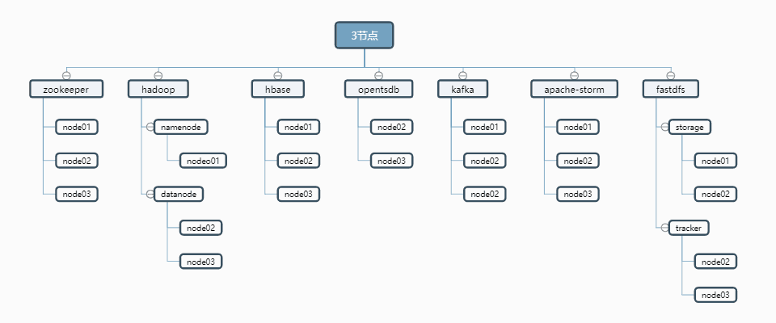
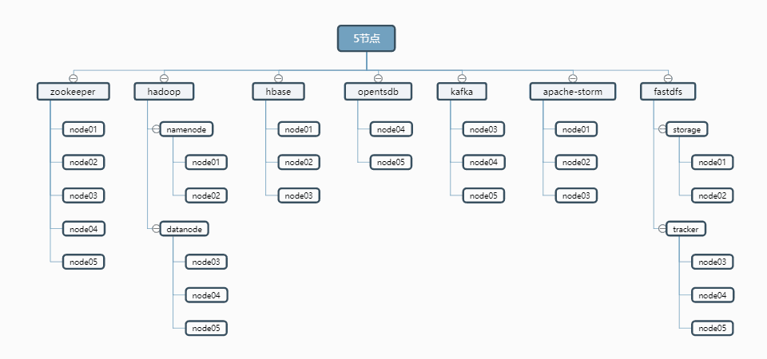

 - 0. 此安装脚本包含的软件
  - install.sh < zookeeper, hadoop, hbase, opentsdb, kafka, storm, fastdfs >
  - install-other.sh [ mysql, mongodb, emqtt, node, redis, tomcat, hazelcase, mysqlbackup ]
 - 1. 请根据实际主机数量选择配置模板 cp host-3.cfg conf.cfg 或 cp host-5.cfg conf.cfg(分别对应3节点hdp单namenode,5节点双namenode)
 - 2. 执行安装前需要修改 SERVERS ,IP 数组(主机名/IP) KEEP_VIP(fastdfs 资源访问高可用) SSH_PORT(sshd端口)
 - 3. 在namenode 其中一节点执行 步骤: 0, 1, 2, 4
 - 4. 在所有节点执行 步骤: 3

3节点图



5节点图




## 0.下载解压脚本(node01执行)

```
curl -O http://kaifa.hc-yun.com:30050/mango/mango-base-install/-/archive/master/mango-base-install-master.tar.gz
tar xvf mango-base-install-master.tar.gz
cd mango-base-install-master
```


## 1.创建conf.cfg 配置文件(node01执行)

> 选择配置文件模板(二选一)

    cp host-3.cfg conf.cfg    # 如果是3节点执行此命令否则忽略

    cp host-5.cfg conf.cfg    # 如果是5节点执行此命令否则忽略

> 根据实际情况修改 SERVERS,HOSTS,PASS,KEEP_VIP 变量(节点IP/节点主机名/SSH登录密码/VIP)

```
cat <<'EOF'  >conf.cfg
# IP与主机名对应
SERVERS=(192.168.2.71 192.168.2.72 192.168.2.73 192.168.2.74 192.168.2.75)
HOSTS=(node01 node02 node03 node04 node05)

# 免密码登录账号密码
USER=root
PASS=ROOTPASS
SSH_PORT=22

# 下载的软件包路径
PACKAGE_DIR=/home/software

# 需要编译的软件解压路径
SOURCE_DIR=/usr/local/src

# 程序安装路径
SOFT_INSTALL_DIR=/home/hadoop

# 数据存储路径
DATA=/home/hadoop

# zookeeper
ZOO_SERVER='node01 node02 node03 node04 node05'

# hadoop
# namenode HA
HDP_NN1='node01'
HDP_NN2='node02'
HDP_RM1='node01'
HDP_RM2='node02'

# 安装 namenode 主机
NameNode='node01 node02'

# 安装 datanode 主机
DataNode='node03 node04 node05'

# fastdfs
# 数据存储路径
TRACKER_DIR=$DATA/fastdfs/tracker
STORAGE_DIR=$DATA/fastdfs/storage

# 配置 tracker 角色的主机
TRACKER_SERVER='node03 node04 node05'

# 配置 storage 角色的主机
STORAGE_SERVER='node01 node02'

# storage 角色主机 keepelived 配置(8888端口高可用)
# keepalived master角色
KEEP_MASTER='node02'

# keepalived VIP
KEEPLIVED=yes
KEEP_VIP=192.168.2.70

# hbase 
# hbase 主节点
HBASE_MASTER='node01'

# hbase 从节点
HBASE_SLAVE='node02 node03'

# opentsdb
TSDB_SERVER='node04 node05'

# kafka
KAFKA_SERVER='node03 node04 node05'

# storm
# storm 主节点
STORM_MASTER='node01'

# storm 从节点
STORM_SLAVE='node02 node03'

#---------------------------------
#            软件版本            #
#---------------------------------
JDK_VER=8u211
ZOOKEEPER_VER=3.4.14
HADOOP_VER=2.7.7
HBASE_VER=1.2.12
OPENTSDB_VER=2.4.0
KAFKA_VER=2.12-2.2.0
STORM_VER=1.2.2
FASTDFS_VER=5.11
LIBFASTCOMMON_VER=1.0.39
NGINX_VER=1.14.2
FASTDFS_NGINX_MODULE_VER=1.20
EOF
```

## 2.下载软件及安装脚本推送到所有节点(node01执行)


    ./download.sh

> download.sh 执行过程

 - 1. 执行download.sh
   - 1.1. 安装wget expect
   - 1.2. 配置秘钥登录所有节点
   - 1.3. 下载软件后台推送到其他节点
   - 1.4. 下载安装脚推送到其他节点

## 3.安装软件(所有节点执行)

    cd /home/software && sh install.sh

> install.sh 执行过程

 - 1.初始化(所有节点)
   - 1.0. 设置主机名,hosts解析
   - 1.1. 优化ssh连接速度
   - 1.2. 关闭selinux,防火墙
   - 1.3. 配置YUM源(阿里云)
   - 1.4. 配置时间同步(阿里云)

 - 2.根据配置文件中的变量判断当前节点需要安装的服务执行安装

## 4.执行环境初始化(node01执行)

> hadoop 初始化, 执行完成后检查 hadoop 状态确认正常后再初始化 opentsdb

    sh /home/software/init-hadoop.sh
    
    # 确认初始化完成后删除初始化脚本
    rm -f /home/software/init-hadoop.sh

> opentsdb 初始化

    sh /home/software/init-opentsdb.sh.sh
    
    # 确认初始化完成后删除初始化脚本
    rm -f /home/software/init-opentsdb.sh.sh

## 5.服务管理(仅node01有效)

    mango stop    # 关闭服务
    mango start   # 启动服服务

## 6.查看服务安装信息

    sh /home/software/info.sh {ip/hosts}

## 7.安装其他服务

```
curl -O http://kaifa.hc-yun.com:30050/mango/mango-base-install/raw/master/install-other.sh
chmod +x install-other.sh && ./install-other.sh


----------------- 请输入编号安装相应服务 -----------------

    0. Install MySql
    1. Install MongoDB
    2. Install Emqtt
    3. Install Node
    4. Install Redis
    5. Install JDK
    6. Install Tomcat
    7. Install Hazelcast
    8. MySql Backup(Rsync)
    9. Exit

----------------------------------------------------------
```
