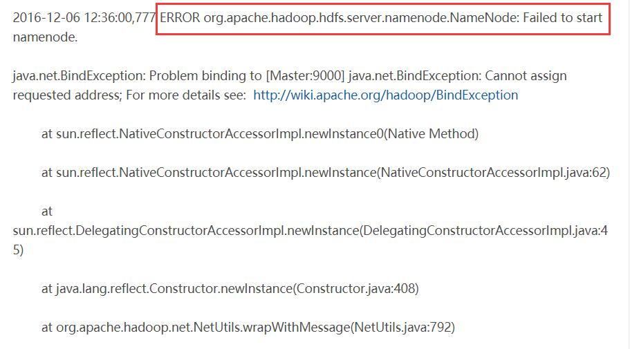
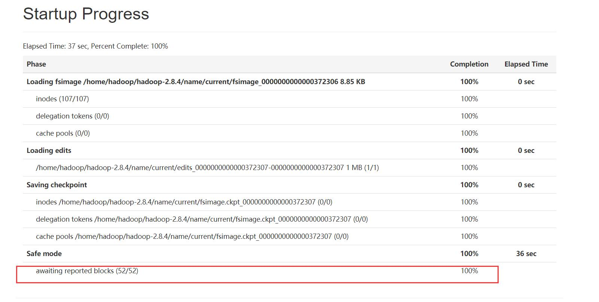
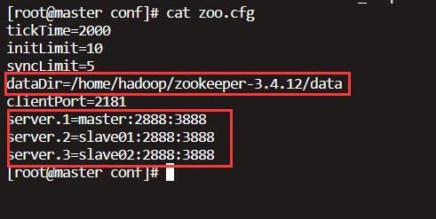
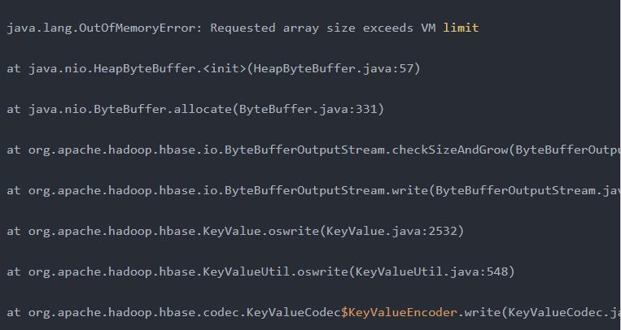
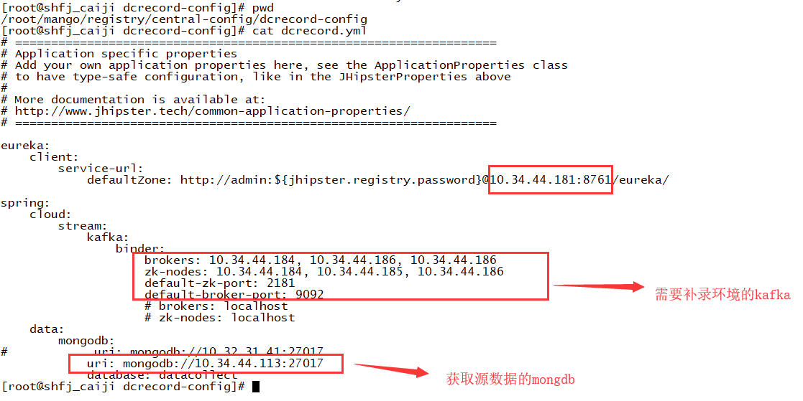
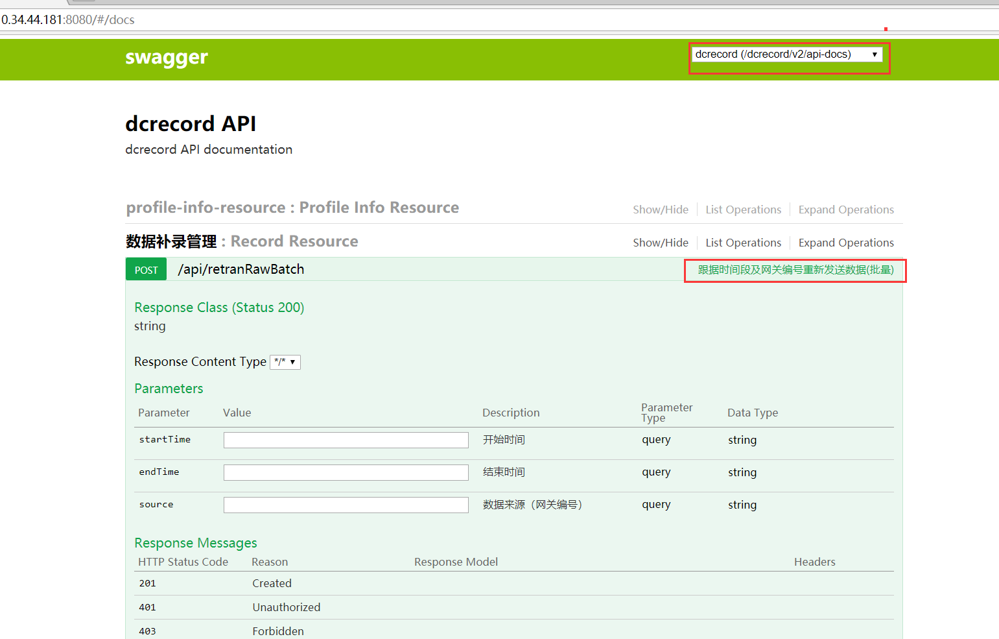
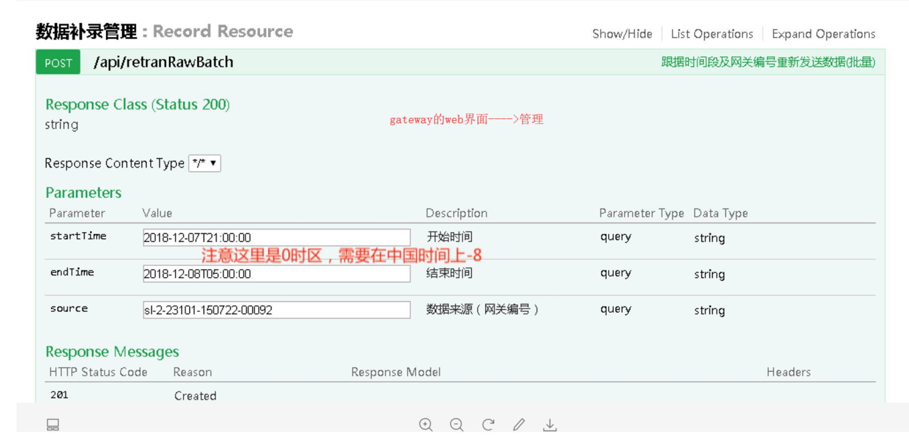

## 故障处理

### 采集异常处理
①确定使用版本，根据版本进行采集的安装与部署，具体部署方式查看相关章节。

举例：10D版本<------->dcapi-1.2.0.0002.war

②查看数据是否推送到dcapi里面（有数据）
进入到放dcapi的war包目录下，查看dcapi的日志是否有数据上来。

③无数无推送到的dcapi里面。

分析原因：

（1）现场网关并没有数据传到szkernel里面。

（2）防火墙问题。dcapi所在防火墙没有开通对应端口。

④szkernel推送数据问题。
此处特别注意：推送数据写dcapi所在服务器里面运行的**gateway端口**并不是dcapi的端口。

此处是填写了dcapi的端口错误现象：

### hadoop故障处理
hadoop最常见的报错就是由于非正常关机，造成元数据不一致，导致namenode启动失败。

查看hadoop的日志日志（hadoop-root-namenode-master.log），发现报错，如下：

解决办法：

①停止掉主从节点的hadoop服务。

②退出安全模式，默认master节点。命令：hadoop dfsadmin -safemode leave

再次启动hadoop集群，查看元数据是否加载完毕。

③如若再次报错，启动namenode内存不足，可以修改主节点的配置文件。

至此，等待元数据加载完成，具体情况可以查看hadoop-root-namenode-master.log日志。
### hbase异常处理
①拒绝连接

查看zookeeper的配置文件

（1）查看对应的目录是否存在，若无创建。

（2）查看主机名是否对应。命令：cat /etc/hosts

（3）关闭防火墙

（4）查看主从节点时间是否对应。

②堆内存溢出的问题。

从错误本身可以发现是堆错误，很明显是设置的值太小而导致这样错误。
查看hadoop的配置文件hadoop-evn.sh，将export HADOOP_HEAPSIZE= 注释给弄掉，然后修改为export HADOOP_HEAPSIZE=4000
### 其它问题处理
①war包版本和preprocess预处理版本不一致。

②补录数据。

（1）将补录数据dcrecord的war包以及配置文件放到跑gateway的服务器上。

（2）修改dcrecord包的配置文件。

(3)启动war包，注意**端口**冲突以及**路径**问题。

nohup /root/mango/dcrecord/dcrecord-1.0.0.0001.war --server.port=9090 >/dev/null 2>&1 &

（4）登陆web界面查看是否成功。

ip:gateway服务端口/home.html

（5）确定需要补录的网关编号，时间。**注意**：时间在需要补录的时间基础上减8小时。

  例如数据中断在13:00，此刻需要从5:00开始补录。

③Hazelcast问题。

（1）在启动芒果所有服务之前，首先启动Hazelcast。

（2）停止Hazelcast，建议使用/bin/stop.sh，查看pid文件是否存在。

④内存过小，启动war包问题。

（1）如果服务器内存过小，此处建议对war包进行内存限制，但registrywar包不可以限制，而且loong和gatewaywar包建议内存给2g，其它war包1g。

（2）使用nohup启动war包时注意要相对路径，使用java -jar启动注意是绝对路径。

nohup /root/mango/uaa/uaa-1.0.2.0005.war --spring.profiles.active=prod  &

nohup java -jar -Xmx1g -Xms1g uaa-1.0.2.0005.war > uaa.log &

⑤