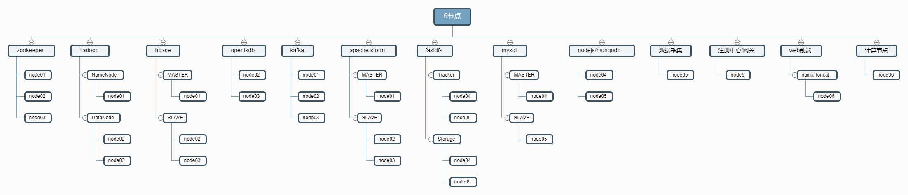

### 基础环境快速部署

>最近有很多同事在部署的时候遇到了各种各样的问题，很多都是一些对环境不熟悉/操作不仔细/网络不给力/修改了不该修改的配置导致，所以专门提供了快速部署脚本，让各位小伙伴们进行快速部署芒果数据采集环境。

**注意**

- 此部署为分布式脚本部署
- 快速部署体验版本为：Beta1.0.1
- 快速部署和分布式手动部署稍有不同，默认提供脚本批量执行，供快速上手
- 项目使用针对技术爱好者强烈推荐分布式手动部署，更快的熟悉每个模块的功能，便于后续排错 [分布式手动部署文档](https://mgdatastorm.readthedocs.io/en/latest/install/distributed_install.html)

**配置说明**
- 标配6台：三台用于时序数据采集和存储，另三台用于微服务部署和结构数据存储。
- 中配8台：五台用于时序数据采集和存储，另三台用于微服务部署和结构数据存储。
- 高配12台：六台用于时序数据采集和存储，另六台用于微服务部署和结构数据存储。

 - 系统： CentOS7+
 - CPU：  8Core+
 - 内存：  16G+
 - 磁盘：  >=100GB+ `存储空间计算参考:100个测点1分钟采集一次，年存储空间消耗30GB。`

> 下面以标配6节点安装：



**适配系统**
- 测试兼容阿里云CentOS7+、Redhat7+
- 测试兼容华为云CentOS7+、Redhat7+
- 测试兼容腾讯云CentOS7+、Redhat7+
- 其余平台/系统目前暂时没有进行过多测试

**下载解压部署脚本(node01执行)**

    cd /root
    curl -O http://kaifa.hc-yun.com:30050/mango/mango-auto-install.git
    tar xvf mango-auto-install-master.tar.gz
    cd mango-auto-install-master

**创建配置文件(node01执行)**

- 选择配置文件模板,将SERVERS,HOSTS,PASS,KEEP_VIP四处变量改为需要部署机器的信息
- 可选模板 host-6.cfg host-8.cfg host-12.cfg

```shell
/usr/bin/cp host-6.cfg conf.cfg
```

变量说明(配置文件中有说明参数作用)：
- SERVERS: 安装 mango 环境虚拟机 IP 地址
- HOSTS: 安装 mango 环境虚拟机主机名
- PASS: 主机 root 用户密码
- KEEP_VIP: fastdfs 资源访问IP

**下载软件及安装脚本推送到所有节点(node01执行)**

    sh /home/software/mango-auto-install/download.sh

- download.sh执行过程
   - 安装wget expect
   - 配置秘钥登录所有节点
   - 下载软件后台推送到其他节点
   - 下载安装脚本推送到其他节点

**安装软件(所有节点执行)**

    cd /home/software/mango-auto-install && sh install.sh

- install.sh 执行过程初始化(所有节点)
   - 设置主机名,hosts解析
   - 优化ssh连接速度
   - 关闭selinux,防火墙
   - 配置YUM源(阿里云)
   - 配置时间同步(阿里云)

- 根据配置文件中的变量判断当前节点需要安装的服务执行安装

**执行环境初始化(node01执行)**

> hadoop 初始化, 执行完成后检查 hadoop 状态确认正常后再初始化 opentsdb

    sh /home/software/mango-auto-install/init-hadoop.sh

    # 确认初始化完成后删除初始化脚本
    rm -f /home/software/mango-auto-install/init-hadoop.sh

> opentsdb 初始化

    sh /home/software/mango-auto-install/init-opentsdb.sh.sh    

    # 确认初始化完成后删除初始化脚本
    rm -f /home/software/mango-auto-install/init-opentsdb.sh.sh

**服务管理(仅node01有效)**

> hadoop环境服务管理(zookeeper,hadoop,hbase,opentsdb,kafka,apache-storm)

    mango stop    # 关闭服务
    mango start   # 启动服服务

> 其他服务管理

    systemctl {status|start|stop} mysql
    systemctl {status|start|stop} mongod
    systemctl {status|start|stop} redis
    systemctl {status|start|stop} haze
    systemctl {status|start|stop} emqtt
    systemctl {status|start|stop} tomcat

**查看服务安装信息**

    sh /home/software/mango-auto-install/info.sh {ip/hosts}

**日志路径**

- 若这里访问有报错，请看下日志，一般都是配置错误。
- 日志路径：所有模块日志统一`/home/hadoop/模块名/logs`
