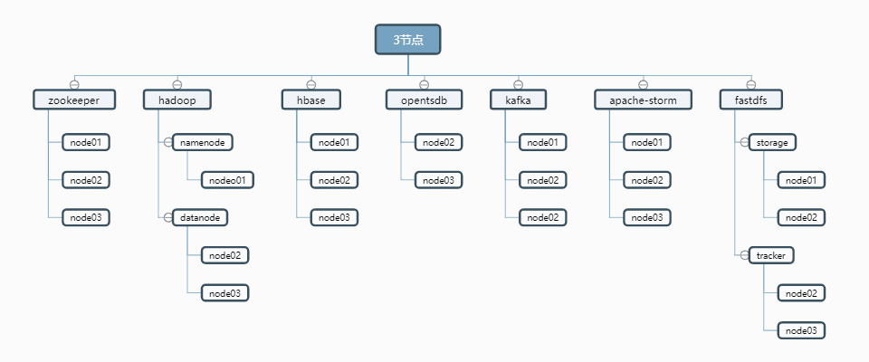

### 快速部署

>这里先简单说明下，最近有很多同事在部署的时候遇到了各种各样的问题，很多都是一些文档不仔细/网络不给力/修改了不改修改的配置导致的，所以专门提供了快速部署，让各位小伙伴们进行快速部署芒果系统的相关环境。


**注意**

- 此部署为分布式脚本部署
- 此部署文档可在线上使用
- 快速部署体验版本为：Beta1.0.1
- 快速部署和分布式手动部署稍有不同，默认提供脚本批量执行，供快速上手
- 项目使用针对技术爱好者强烈推荐分布式手动部署，更快的熟悉每个模块的功能，便于后续排错 [分布式手动部署文档](https://mgdatastorm.readthedocs.io/zh_CN/latest/install/distributed_install.html)


**建议配置**
> 标配6台：三台用于时序数据采集和存储，另外三台用于微服务应用部署和结构数据存储。
- 系统： CentOS7+
- CPU：  8Core+
- 内存：  16G+
- 磁盘：  >=50+


**适配系统**
- 测试兼容阿里云CentOS7+
- 测试兼容华为云CentOS7+
- 测试兼容腾讯云CentOS7+
- 其余平台/系统没有进行多测试


**优化系统**

- 如果你的系统是新的，我们建议你先优化下系统，此步非必须，同样我们也提供了[优化系统脚本](https://github.com/bigdatasafe/mgdatastorm/blob/master/script/system_init_v1.sh)
- 以下基础环境中，若你的系统中已经存在可跳过，直接配置，建议使用我们推荐的版本

**快速开始**

- 此安装脚本包含以下软件
  - install.sh [ zookeeper, hadoop, hbase, opentsdb, kafka, storm, fastdfs ]
  - install-other.sh [ mysql, mongodb, emqtt, node, redis, tomcat, hazelcase, mysqlbackup ]


```shell  
#克隆工程脚本，赋权执行即可，执行的时候将你的内网IP当作参数传进来
yum install -y git
git clone https://github.com/bigdatasafe/mg-base-install.git
cd mg-base-install
```  

**修改conf.cfg配置文件(node01执行)**

> 选择配置文件模板(二选一)

    \cp host-3.cfg conf.cfg    # 默认为3节点无需执行，可忽略。

    \cp host-5.cfg conf.cfg    # 如果是5节点执行此命令否则忽略

> 根据实际情况修改 SERVERS,HOSTS,PASS,KEEP_VIP 变量(节点IP/节点主机名/SSH登录密码/VIP)

```shell
cat <<'EOF'  >conf.cfg
# IP与主机名对应
SERVERS=(192.168.2.71 192.168.2.72 192.168.2.73 192.168.2.74 192.168.2.75)
HOSTS=(node01 node02 node03 node04 node05)

# 免密码登录账号密码
USER=root
#请修改为各节点root密码
PASS=ROOTPASS
SSH_PORT=22

# 下载的软件包路径
PACKAGE_DIR=/home/software

# 需要编译的软件解压路径
SOURCE_DIR=/usr/local/src

# 程序安装路径
SOFT_INSTALL_DIR=/home/hadoop

# 数据存储路径
DATA=/home/hadoop

# zookeeper
ZOO_SERVER='node01 node02 node03 node04 node05'

# hadoop
# namenode HA
HDP_NN1='node01'
HDP_NN2='node02'
HDP_RM1='node01'
HDP_RM2='node02'

# 安装 namenode 主机
NameNode='node01 node02'

# 安装 datanode 主机
DataNode='node03 node04 node05'

# fastdfs
# 数据存储路径
TRACKER_DIR=$DATA/fastdfs/tracker
STORAGE_DIR=$DATA/fastdfs/storage

# 配置 tracker 角色的主机
TRACKER_SERVER='node03 node04 node05'

# 配置 storage 角色的主机
STORAGE_SERVER='node01 node02'

# storage 角色主机 keepelived 配置(8888端口高可用)
# keepalived master角色
KEEP_MASTER='node02'

# keepalived VIP
KEEPLIVED=yes
KEEP_VIP=192.168.2.70

# hbase 
# hbase 主节点
HBASE_MASTER='node01'

# hbase 从节点
HBASE_SLAVE='node02 node03'

# opentsdb
TSDB_SERVER='node04 node05'

# kafka
KAFKA_SERVER='node03 node04 node05'

# storm
# storm 主节点
STORM_MASTER='node01'

# storm 从节点
STORM_SLAVE='node02 node03'

#---------------------------------
#            软件版本            #
#---------------------------------
JDK_VER=8u211
ZOOKEEPER_VER=3.4.14
HADOOP_VER=2.7.7
HBASE_VER=1.2.12
OPENTSDB_VER=2.4.0
KAFKA_VER=2.12-2.2.0
STORM_VER=1.2.2
FASTDFS_VER=5.11
LIBFASTCOMMON_VER=1.0.39
NGINX_VER=1.14.2
FASTDFS_NGINX_MODULE_VER=1.20
EOF
```

**下载软件及安装脚本推送到所有节点(node01执行)**

    ./download.sh

> download.sh 执行过程

 - 执行download.sh
   - 安装wget expect
   - 配置秘钥登录所有节点
   - 下载软件后台推送到其他节点
   - 下载安装脚推送到其他节点

**安装软件(所有节点执行)**

    cd /home/software && sh install.sh

> install.sh 执行过程

 - 初始化(所有节点)
   - 设置主机名,hosts解析
   - 优化ssh连接速度
   - 关闭selinux,防火墙
   - 配置YUM源(阿里云)
   - 配置时间同步(阿里云)

 - 根据配置文件中的变量判断当前节点需要安装的服务执行安装

**执行环境初始化(node01执行)**

> hadoop 初始化, 执行完成后检查 hadoop 状态确认正常后再初始化 opentsdb

    sh /home/software/init-hadoop.sh
    
    确认初始化完成后删除初始化脚本
    rm -f /home/software/init-hadoop.sh

> opentsdb 初始化

    sh /home/software/init-opentsdb.sh.sh
    
    确认初始化完成后删除初始化脚本
    rm -f /home/software/init-opentsdb.sh.sh

**服务管理(仅node01有效)**

    mango stop    # 关闭服务
    mango start   # 启动服服务

**查看服务安装信息**

    sh /home/software/info.sh {ip/hosts}

**安装其他服务**

```
curl -O http://kaifa.hc-yun.com:30050/mango/mango-base-install/raw/master/install-other.sh
chmod +x install-other.sh && ./install-other.sh


----------------- 请输入编号安装相应服务 -----------------

    0. Install MySql
    1. Install MongoDB
    2. Install Emqtt
    3. Install Node
    4. Install Redis
    5. Install JDK
    6. Install Tomcat
    7. Install Hazelcast
    8. MySql Backup(Rsync)
    9. Exit

----------------------------------------------------------
```

**日志路径**

> 若这里访问有报错，请看下日志，一般都是配置错误。
- 日志路径：所有模块日志统一`/var/log/supervisor/`