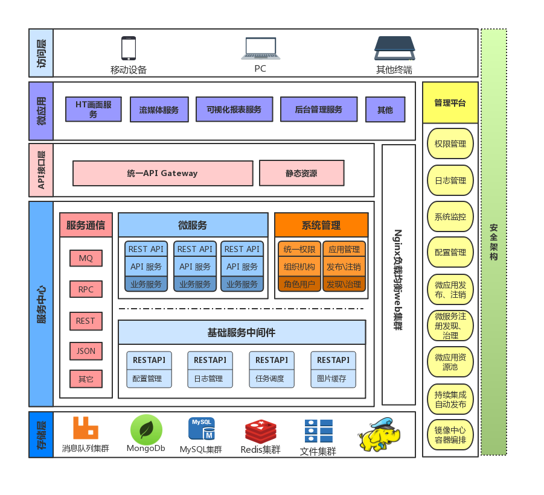

## 介绍

### MgDataStorm

----
MgDataStorm是昊沧历时三年研发的一款工业物联网Saas化业务系统。

本文主要针对DataStorm数据云平台的安装部署及故障处理做文档归集。

DataStorm数据云平台目前主要分前端、后端、监视画面、报表、数据处理。

DataStorm前端基于Vue iview开发、为用户提供友好的操作界面，增强用户体验。

DataStorm后端基于Spring Cloud开发，其优势为轻量、简洁清晰、异步非阻塞。

DataStorm数据云平台为用户提供多功能：大屏画面、数据展示、数据处理、报表统计、设备管理、视频监控、库存管理、监控报警等

更多详细内容我们一直在不停的补充优化，如果你对此项目感兴趣可以加入我们的社区QQ交流群：153258678

同时也希望你能给我们项目一个star，为贡献者加油⛽️！为运维干杯🍻！

----

### Mangoservice

- nginx
  - 功能：项目前端
  - 端口：80/443
  - 安装：必须
  - 检测：`curl -I -X GET -m 10 -o /dev/null -s -w %{http_code} http://${nginx_domain}:80/`

- mysqld
  - 功能：关系型数据库
  - 端口：3306
  - 安装：必须
  - 检测：`netstat -tnalp|grep :3306`

- emqttd
  - 功能：消息引擎
  - 端口：1883/8083/18083
  - 安装：必须
  - 检测：`curl -I -X GET -m 10 -o /dev/null -s -w %{http_code} http://${emq_domain}:18083/`

- mongodb
  - 功能：缓存数据库
  - 端口：27017
  - 安装：必须
  - 检测：`curl -I -X GET -m 10 -o /dev/null -s -w %{http_code} http://${mogo_domain}:27017/`

- hadoop
  - 功能：大数据分布式文件系统
  - 端口：50070
  - 安装：必须
  - 检测: `curl -I -X GET -m 10 -o /dev/null -s -w %{http_code} http://${hdp_domain}:50070/`

- zookeeper
  - 功能：分布式应用程序协调服务
  - 端口：2181
  - 安装：必须
  - 检测: `netstat -tnalp|grep :2181`

- hbase
  - 功能：分布式面向列的数据库
  - 端口：16010
  - 安装：必须
  - 检测: `curl -I -X GET -m 10 -o /dev/null -s -w %{http_code} http://${hbase_domain}:16010/`
  

- kafka
  - 功能：高吞吐量的分布式发布订阅消息系统
  - 端口：9092
  - 安装：必须
  - 检测: `netstat -tnalp|grep :9092`
  
- storm
  - 功能：分布式流式计算的结构
  - 端口：8080
  - 安装：必须
  - 检测: `curl -I -X GET -m 10 -o /dev/null -s -w %{http_code} http://${storm_domain}:8080/`
  
- opentsdb
  - 功能：时间序列数据库
  - 端口：4242
  - 安装：必须
  - 检测：`curl -I -X GET -m 10 -o /dev/null -s -w %{http_code} http://${tsdb_domain}:4242/`

- fastdfs
  - 功能：轻量型分布式文件系统
  - 端口：22122
  - 安装：必须
  - 检测：`netstat -tnalp|grep :22122`
  
- redis
  - 功能：轻量型分布式文件系统
  - 端口：6379
  - 安装：必须
  - 检测：`netstat -tnalp|grep :6379`

### Architecture

- Apigateway spring cloud代理前端软件
- ApigateWay依赖registory服务，需要安装jdk
- 微服务部署完成后，运行系统是服务会自动注册
- Mango平台整体架构示例，不同的微服务使用单独的库

